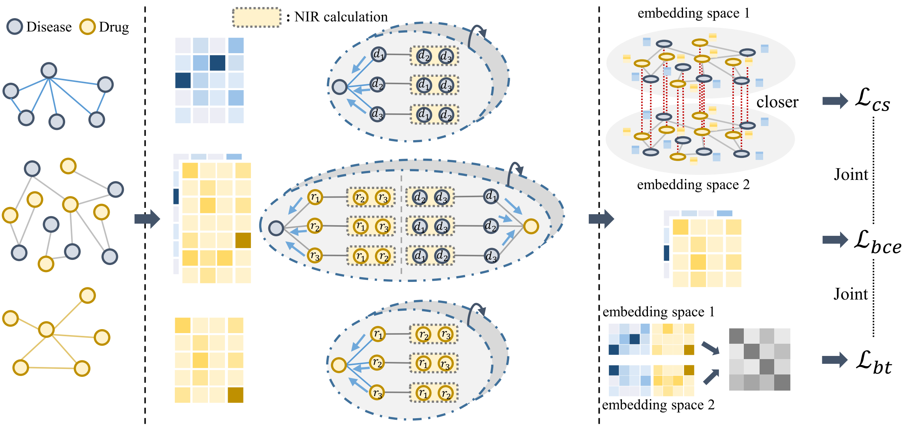
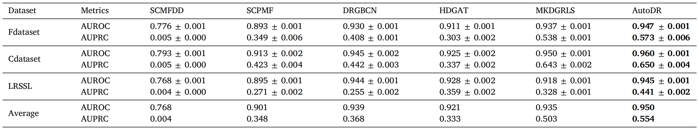

# Automatic collaborative learning for drug repositioning

This is the PyTorch implementation for **AutoDR** proposed in the paper [**Automatic collaborative learning for drug repositioning**](https://doi.org/10.1016/j.engappai.2024.109653), which is published by **Engineering Applications of Artificial Intelligence**. 

> Yi Wang, Yajie Meng, Chang Zhou, Xianfang Tang, Pan Zeng, Chu Pan, Qiang Zhu, Bengong Zhang, Junlin Xu. 2024. Automatic collaborative learning for drug repositioning. Engineering Applications of Artificial Intelligence.



In this paper, we introduce a novel model, an automatic collaborative learning framework for drug repositioning. Initially, we propose a metric to measure the interaction levels among neighbors and integrate it with the intrinsic message-passing mechanism of GNN, thereby enhancing the impact of various collaborative effects on prediction accuracy. Furthermore, we introduce an advanced contrastive learning technique to align feature consistency between the disease–drug association space and the customized neighbor space.

## 📝 Environment

We develop our codes in the following environment:

- python==3.7.7
- torch==1.13.1
- torch-geometric==2.3.1
- torch-scatter==2.1.1

## 📚 Datasets

| Statistics         | Fdataset | Cdataset | LRSSL  |
|--------------------|----------|----------|--------|
| # Diseases         | 313      | 409      | 681    |
| # Drugs            | 593      | 663      | 763    |
| # Associations     | 1933     | 2532     | 3051   |
| # Density          | 0.0104   | 0.0093   | 0.0058 |


## 🚀 How to run the codes

The command lines to train AutoDR on the three datasets are as below. The un-specified hyperparameters in the commands are set as default.

- Fdataset

```python
python main.py --dataset Fdataset
```

- Cdataset

```python
python main.py --dataset Cdataset
```

- LRSSL

```python
python main.py --dataset LRSSL
```


## 🎯 Experimental Results

Performance comparison of baselines on different datasets in terms of AUROC and AUPRC:




## 👉 Code Structure

```
.
├── README.md
├── AutoDR.png
├── Performance.png
├── code
│   ├── main.py
│   ├── model.py
│   ├── loader.py
│   └── utils.py
└── dataset
    ├── Fdataset
    │   └── Fdataset.mat
    ├── Cdataset
    │   └── Cdataset.mat
    └── LRSSL
        ├── lrssl_admat_dgc.txt
        ├── lrssl_simmat_dc_chemical.txt
        ├── lrssl_simmat_dc_domain.txt
        ├── lrssl_simmat_dc_go.txt
        └── lrssl_simmat_dg.txt
```

## 🌟 Citation

If you find this work helpful to your research, please kindly consider citing our paper.

```
@article{wang2025automatic,
  title={Automatic collaborative learning for drug repositioning},
  author={Wang, Yi and Meng, Yajie and Zhou, Chang and Tang, Xianfang and Zeng, Pan and Pan, Chu and Zhu, Qiang and Zhang, Bengong and Xu, Junlin},
  journal={Engineering Applications of Artificial Intelligence},
  volume={139},
  pages={109653},
  year={2025},
  publisher={Elsevier}
}
```

